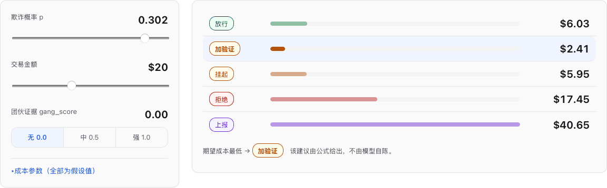
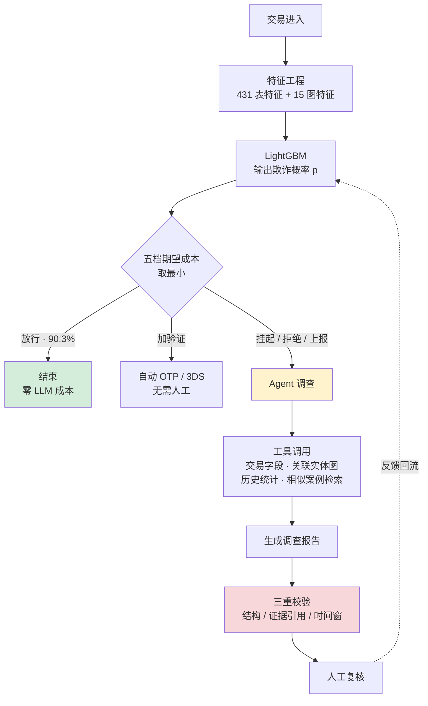

# AI Fraud Investigation Copilot

**交易反欺诈决策系统** —— 风险评分、成本最优处置、AI Agent 自动取证，三者串成一条可复算的流水线。

<sub>*A transaction fraud decision system: GBDT risk scoring → cost-optimal action selection → LLM agent evidence gathering → human review. Built on the Kaggle IEEE-CIS dataset.*</sub>




> 上图是仓库内置的**交互演示页**：拖动交易金额，五档动作的期望成本实时重算，最优档在 $73.88 和 $400.71 两处翻转。
>
> **▶ 在线打开：https://1257599842-cell.github.io/AI-Agent-Fraud-Detection/**
> 或本地 `open reports/demo/index.html` —— 单个 HTML 文件，不联网、不调 API、不需要装任何东西。

---

## 目录

[系统做什么](#系统做什么) · [快速开始](#快速开始) · [架构](#架构) · [核心模块](#核心模块) · [结果](#结果) · [仓库结构](#仓库结构) · [可复算性](#可复算性) · [局限](#局限)

---

## 系统做什么

一笔交易进来，系统在三个环节做三件不同的事：

| 环节 | 组件 | 输出 |
|---|---|---|
| **1. 评分** | LightGBM 风险模型 | 欺诈概率 `p` |
| **2. 决策** | 五档期望成本 argmin | 放行 / 加验证 / 挂起 / 拒绝 / 上报 |
| **3. 取证** | LLM Agent（仅对非放行交易触发） | 结构化调查报告，每条结论挂证据 ID |

`/score` 接受**原始交易字段**，在线算出 27 列历史特征（含两层时间纪律）后真正调用模型——
不是查预先算好的分。在线与离线的一致性由**有状态回放对账**保证（见下）。

最后由人工复核拍板，结果回流。

### 一笔交易的完整旅程



### 三个组件的边界是写死的

- **模型只出概率**，不决定动作。
- **动作由成本公式解出**，不由模型或 Agent 决定。
- **Agent 只负责取证与叙述**，产出的每条结论必须引用具体的证据 ID；它给出的处置建议**不进入决策链**。

这条边界是实测后确定的：Agent 的**团伙判断与代码计算结果的一致率**，显著高于它的**处置建议与成本最优档的一致率**
（**89% vs 57%**，各自扣除多数类基线后净差 **+21pp**），所以取证归 Agent、算术归公式。

> 这是**一致率，不是准确率**——它说明两者互相同意，不说明两者都对。用真实标签做效度检验时置信区间跨 0，**未测出**（见 [`MODEL_CARD.md`](./MODEL_CARD.md) §10）。

---

## 快速开始

```bash
# 1. 装依赖
python3 -m venv .venv && source .venv/bin/activate && pip install -r requirements.txt

# 2. 看演示（不需要数据，不需要跑任何东西）
open reports/demo/index.html            # 或直接访问在线版（见文首链接）

# 3. 跑测试
python -m unittest discover -s tests -t .
```

要复现 ML 结果需要数据（Kaggle 账号 + 同意比赛条款）：

```bash
kaggle competitions download -c ieee-fraud-detection -p data/raw && unzip -q 'data/raw/*.zip' -d data/raw
python -m src.features.load_data        # 合并两张表 + EDA
python -m src.features.graph_features   # 图特征（两层时间纪律）
python -m src.model.train_baseline      # 训练 + 评估
python -m src.agent.disposition         # 四档处置的期望成本与应然档
```

启动服务：

```bash
uvicorn src.serving.app:app --port 8000
# POST /score        收原始交易字段 → 在线算特征 → 调模型 → 五档 argmin
# GET  /demo/score   薄壳：按 ID 取原始行，喂进同一条路径（不复制打分逻辑）
# POST /investigate  Agent 调查（仍按 ID 回放，见「局限」）
# GET  /healthz
docker build -t fraud-copilot . && docker run -p 8000:8000 fraud-copilot
```

> macOS 装 LightGBM 可能需要先 `brew install libomp`。

---

## 架构

```
┌─────────────────────────────────────────────────────────────┐
│  ① 特征层    表特征(431) + 图特征(15)                          │
│              两层时间纪律：结构型 < t，标签型 < t − 21 天        │
│              双实现：pandas / DuckDB 星型模型（逐行对账）        │
├─────────────────────────────────────────────────────────────┤
│  ② 模型层    LightGBM · 时间切分 · 概率校准验证                 │
│              主指标 PR-AUC（不平衡下 ROC 会骗人）               │
├─────────────────────────────────────────────────────────────┤
│  ③ 决策层    五档期望成本 argmin                               │
│              放行 / 加验证 / 挂起 / 拒绝 / 上报                 │
│              成本参数全部 [假设] + 敏感性扫描                    │
├─────────────────────────────────────────────────────────────┤
│  ④ Agent层   4 个工具 · RAG 检索 · 结构化报告 · 三重校验         │
│              闸门：90.3% 交易不进此层                          │
│              兜底：LLM 不可用时降级为规则模板报告                 │
├─────────────────────────────────────────────────────────────┤
│  ⑤ 工程层    FastAPI · Docker · eval · 成本监控 · 漂移监控      │
└─────────────────────────────────────────────────────────────┘
```

**数据**：Kaggle [IEEE-CIS Fraud Detection](https://www.kaggle.com/competitions/ieee-fraud-detection)（Vesta 真实电商交易）
590,540 笔 · 434 列 · 欺诈率 3.499% · 跨度 182 天 · identity 覆盖 24.42%。
评估集由 train 按时间切分得到；Kaggle 官方 test 无标签，不参与任何线下评估。

---

## 核心模块

### ① 特征工程：两层时间纪律

反欺诈的标签有延迟——一笔交易是否欺诈，往往要等用户发起拒付才知道，而拒付可能几周后才到。
因此**不是所有历史信息在预测时刻都可用**。系统把事实分成两类，各自受不同约束：

| 类型 | 例子 | 时间约束 |
|---|---|---|
| **结构型** | 一张卡关联过几台设备（fan-out）、历史交易笔数 | 只用 `t` 之前发生的 |
| **标签型** | 该卡的历史欺诈率 | 还要再退 **21 天**（标签成熟期 / embargo） |

这条纪律贯穿特征、规则库、案例库、Agent 取证四处，并由 `audit_time_boundary()` 在每次调查时逐条审计。

除历史统计外，还有一类**短窗速度特征**（velocity）：同一实体在过去 1 / 6 / 24 小时内的交易笔数。
它不读标签，所以不需要 embargo，但需要按时间**取值**判断窗口归属（见下方折叠区的更正说明）。

**代价是诚实的**：加 embargo 后 PR-AUC 从 0.5645 掉到 0.5323。把这个 gap 拆开后，
**数据量损失 ≈ 0，新鲜度损失 −0.037** —— 掉的几乎全是「拿不到最新标签」的真实代价，不是训练数据变少。

<details>
<summary><b>图特征：为什么用 GBDT + 图特征而不是 GNN</b></summary>

图特征把交易连成网络：同一张卡关联了多少设备 / 地址 / 邮箱（fan-out），以及这些组合键的历史欺诈率。
这是「团伙共享稀有实体」的信号。

- **干净对照**：纯表 vs 表+图，PR-AUC **+0.039**
- **泄漏审计**：把 embargo 从 21 天拉到 60 天，增益缩到 +0.023 —— **缩但不崩**，说明是真信号不是泄漏
- **分组消融**：这 +0.039 里 **~100% 来自实体标签历史**，纯结构特征（度 / fan-out）贡献 ≈ 0（−0.0008）

第三条是关键：结构信号**已经被数据集里的匿名计数特征 C/V 吸收了**，而 GNN 要挖的正是这部分。
所以 GNN 对照臂**放弃且未跑**，不作任何数字声称。

相关脚本：`src/features/graph_features.py` · `src/model/graph_vs_tabular.py` · `src/model/graph_leak_audit.py` · `src/model/graph_feature_ablation.py`

</details>

<details>
<summary><b>双实现：同一套特征，pandas 与 SQL 各写一遍</b></summary>

特征流水线原本是纯 pandas。用 DuckDB + 小星型模型（8 张表）重写一遍，验证的是：
**两层时间纪律能否无损地表达成 SQL 的两种窗口帧。**

| | 语义 | 窗口帧 |
|---|---|---|
| 结构型 | 只问「在不在本行之前」 | `ROWS BETWEEN UNBOUNDED PRECEDING AND 1 PRECEDING` |
| 标签型 | 还要问「标签熟没熟」 | `RANGE BETWEEN UNBOUNDED PRECEDING AND 1814400 PRECEDING` |

`ROWS` 数的是**行的位置**，`RANGE` 比的是**值的大小**（这里是时间戳）。用错帧型，泄漏就从窗口定义漏回来。

> **⚠️ 这张表容易被读成「结构型→ROWS、标签型→RANGE」的一一对应，那是错的。**
> 后来补的 velocity 特征（同一实体过去 1 小时的交易笔数）是**结构型**（不读标签、不需要 embargo），
> 但它必须用 **`RANGE`** —— 「过去一小时」是取值问题，`ROWS` 答不了。
> **帧型（位置 vs 取值）与 embargo（标签是否成熟）是两件正交的事**，
> 上表的对应只是当时那批特征恰好如此。

**对账结果**：15 个特征列与 pandas 版**逐行一致**（浮点 rtol=1e-9）。
**负对照**：故意把 `prior_cnt` 改成 RANGE 帧后，不一致行数从 0 变成 166 —— 证明这套对账有判别力。

另一个坑：SQL 的 `PARTITION BY` 默认把 NULL 视作相等、会把缺失键塌成一个巨型组，
用 `COALESCE(key, '\x00NA#' || transaction_id)` 复刻 pandas 的行为。

DDL：`src/features/sql/01_star_schema.sql` · 特征 SQL：`src/features/sql/02_graph_features.sql` · 对账：`python -m src.features.build_duckdb`

</details>

### ② 风险模型：LightGBM + 时间切分

按时间切分训练/测试（**不是随机切分**），加 21 天 embargo。主指标用 **PR-AUC** 而非 ROC-AUC——
欺诈只占 3.5%，ROC 会被大量易分负样本抬高。

漂移监控实测印证了这点：同一段时间 **ROC 稳如泰山（0.881~0.918、零告警），PR-AUC 却波动 ~0.09**。

<details>
<summary><b>概率校准：验证之后决定不套</b></summary>

成本公式需要真概率（`p=0.7` 得真的意味着「这类交易七成是欺诈」），所以校准质量直接决定阈值对不对。

常规做法是套一层 Platt / Isotonic 后验校准。本项目**测完之后决定不套**：

- LightGBM 用 logloss 训练本身就在优化概率质量
- 实测**决策区间**（top 2%）的校准偏差只有 **0.002**，已经很准
- 套上 Platt / Isotonic 反而恶化到 **0.089 / 0.067**
- 加跑 14 / 28 / 42 天近窗，排除了「校准样本太小」这个混淆

同样地，「重采样 / 给正类加权」这类不平衡处理也做了反例消融：**recall 不升，但校准误差 ECE 从 0.008 爆到 0.09（11 倍）**，
决策区间的预测概率从 0.70 虚高到 0.93。动先验换不来排序质量，只毁概率。

脚本：`src/model/calibration.py` · `src/model/calib_window_size.py` · `src/model/imbalance_ablation.py`

</details>

### ③ 决策层：五档期望成本

判定阈值不是拍 0.5，是把业务成本写进目标函数解出来的。设 `p` = 欺诈概率、`a` = 金额、`c_FP` = 误拦好客户的成本：

| 动作 | 期望成本 | 含义 |
|---|---|---|
| **放行** | `p · a` | 是欺诈就赔整笔 |
| **加验证** | `c_friction + p(1−r_block)·a + (1−p)·r_abandon·margin·a` | 发验证码；挡不住的仍赔，好客户可能因麻烦放弃 |
| **挂起** | `c_review + p·m_h·a + (1−p)·f_h·c_FP` | 转人工，占用复核容量 |
| **拒绝** | `(1−p) · c_FP` | **不含金额项**——拒绝 $10,000 和 $1 同价 |
| **上报** | `c_report + … − p·gang·k_future·A_med` | 冻结实体；末项是拦下该实体未来批量欺诈的收益 |

**最优动作 = 五者 argmin。** 在二档（放行 / 拒绝）简化情形下解出 **t\* = 0.078**（而非 0.5），
有效拦截率 recall 从 0.338 提到 0.623，总成本降 26%。

成本参数在本数据集里**没有真值**，全部标注为 `[假设]`，并配 432 组参数网格的敏感性扫描——
所有依赖它们的结论一律报区间、不报点值。

<details>
<summary><b>上报档的网络项：唯一一个补验过的假设</b></summary>

上报档的成本里有一项 `− p·gang·k_future·A_med`，代表「冻结这个实体能拦下的未来批量欺诈」。
这是四档框架里唯一凭直觉写下的假设，后来做了补验：

高 `gang_score` 实体在**后续 30 天**的欺诈率 lift 为 **4.6–5.0×**，在两个**不重叠**的时间窗上独立复制
（t0=146 → 4.95×、t0=115 → 4.56×），留一实体后仍 4.66×。

**对照怎么选是关键**：必须在「**同样有欺诈史**」的实体内部比较，否则测的只是「有欺诈史 vs 没欺诈史」，是同义反复。

结论：方向已验证、量级未标定。所以成本记账时保守处理（上报的未来收益按零记、成本照记）。

脚本：`src/eval/gang_validity.py`

</details>

### ④ Agent 层：取证与可溯源报告

只对非放行交易触发（**90.3% 的交易在闸门就结束，不产生 LLM 成本**——四档口径；五档下「加验证」也是自动动作，合计 **93.3%** 无需 Agent 或人工）。四个工具：

| 工具 | 返回 |
|---|---|
| `query_transaction` | 本笔交易的原始字段 |
| `query_entity_graph` | 关联实体的度、fan-out、组合键 |
| `query_historical_stats` | 该实体的历史统计（受 embargo 约束） |
| `search_similar_cases` | 相似历史案例（含被人工洗清的假阳） |

每次工具返回都登记为一条 **Fact**（含 `fact_id`、取值、时间窗、结构型/标签型标记）。
Agent 写报告时，每条结论必须引用 `evidence_ids`；报告落盘前过三重校验：

1. **结构校验** —— 字段、枚举值合法（`src/agent/schema.py`）
2. **引用校验** —— 引用的 fact_id 必须真实存在，编造会被拦下
3. **时间审计** —— 每条引用的事实都要过两层时间纪律（`audit_time_boundary`）

**兜底降级**：LLM 不可用时（真实连接失败触发，非 mock），系统照常出分，并用确定性成本框架生成规则模板报告，
**过同一套校验器**，服务返回 200 而非 5xx。

<details>
<summary><b>Agent 的 eval：能机械判定的全部机械判定</b></summary>

Agent 评估分硬层和软层。**硬层**是可被代码判定的部分，不依赖任何裁判：

| 指标 | 结果 |
|---|---|
| 结构合规率 | 99% |
| **编造数字** | **0**（2,672 个数字全量对账） |
| 引用完整率 | 92.4%（finding 级 522/565） |
| 时间审计通过率 | 100% |

数字对账的做法：把报告里出现的每个数字，去证据池里找出处；找不到的再走具名转写规则
（百分数两形态、量级缩写、补数、地板截断等），仍找不到才判为编造。

**软层**（LLM-as-judge）做过，**判定不可用并停报**：裁判是 LLM，而判定标准与示例又出自同一参照方，
分歧下降是构造保证的；且三个实验臂在少数类上的命中（2/3、1/3、0/3）全部落在「按自身标记率瞎猜」的期望内（1.18 / 1.02 / 0.46）——
少数类只有 3 条，样本量不足的地方一致率再高也说明不了什么。

还做了**抗谄媚测试**：把喂给 Agent 的风险分人为拉高 150 倍，观察它的证据陈述是否跟着变。
结果证据层翻转 **0/15**；而冲突检出呈剂量梯度 0% → 27% → 47% → 100%，关键对照 +73pp。

脚本：`src/eval/agent_eval.py` · `src/eval/flip_experiment.py` · `src/eval/abstention_test.py`

</details>

### ⑤ 在线特征存储：把时间纪律变成数据属性

服务要给**没见过的交易**打分，就得在线算出那 27 列历史特征。存储用**双时间戳事件日志**：

| 字段 | 含义 |
|---|---|
| `event_time` | 交易**发生**的时刻 |
| `label_time` | 标签**变为已知**的时刻；**可为 NULL** |

结构型特征只看 `event_time`，标签型还要求 `label_time <= t`。
于是 **embargo 不再是一条要记得执行的纪律，而是数据的可见性属性**——读不到未来的标签，
因为它当时还不在可见集里。

`label_time` 可为 NULL 这一点直接对应**选择性偏差**：未被复核就放行的交易永远拿不到标签，
`prior_fraud_rate` 的分母天然只含被复核过的样本。这条局限在存储层是一个**可以指着看的字段**。

<details>
<summary><b>回放对账：把训练/线上一致性从担心变成断言</b></summary>

把交易逐笔当作新交易喂进存储，**先查后写**（查特征时本笔尚未入库），与离线 parquet 逐列比。

- **对账：3,000 / 3,000 逐列一致**
- **打分：按序回放 800 笔，在线 `p` 与离线逐位相同（最大差 0.00e+00）**

**负对照用预注册的确切数字，不是「断言它失败」**：去掉 ID tiebreak 会让位置语义退化成取值语义，
期望差异行数**在跑之前**已从离线数据算出并冻结——实测 `card1` 11 行、`card1_addr1` 10、
`card1_email` 11、`card1_device` 0，**四个键全部精确命中**。

> 第一版选的回放切片里**一个并列行都没有**，负对照会永远通过、等于没验。
> 预注册确切数字的好处正在这里：0 行时立刻暴露装置没在工作，而「断言它失败」会安静地绿。

**一个真结论**：离线 `prior_cnt` 靠 `TransactionID` 打破 `dt` 并列，
而真实系统里同一秒到达的两笔谁在前是**到达顺序**，不是 ID——`TransactionID` 在线没有对应物。
这是离线特征定义里的一个人造依赖。

**延迟**（单机 · DuckDB · 并发=1 · 无预聚合 · 事件表 33 万行）：p50 14.5 ms、p95 19.3 ms。
按实体历史长度分桶：0–10 笔时 p50 12.2 ms，≥1000 笔时 18.5 ms——
**历史长度跨 100 倍，延迟只涨 50%**，说明开销由「每笔约 15 次查询」主导，不由历史长度主导。
所以预聚合分层买不到什么；真要优化该把 15 次查询合成 1 次。

</details>

### ⑥ 评估与监控

除常规 ML 指标外，仓库把两个通常只停留在口头的问题做成了**可跑的实验**：

**选择性偏差** —— 只有被拦下复核的样本才拿得到标签，放行的欺诈不可观测，回流标签因此有偏。
实验做法：人为遮蔽高分段标签模拟「放行=不可观测」，跑朴素自训练。
结果 test ROC **0.8721 → 0.8478**（三轮分别有 2,123 / 2,417 / 1,774 笔真欺诈被误标成好人）；
加 **2% 随机放行抽检**后末轮 0.8657，**相对 naive 救回 +0.0178**。

**概念漂移** —— 冻结早期模型，在后续每 14 天窗上重新评估，配监控触发器（跌破基线−δ 即告警）。
诚实结论：半年内 **ROC 稳定、0 次触发**；但 PR-AUC 波动 ~0.09，**正类监控该盯 PR 而非 ROC**。

脚本：`src/eval/selective_bias.py` · `src/eval/drift_monitor.py`

---

## 结果

指标一律记为 **X → Y**（改善量），而非孤立的绝对值。

### 模型侧

| 项目 | 结果 |
|---|---|
| 代价敏感阈值 t\*=0.078（c_FP=$25） | recall **0.338 → 0.623**，总成本 **−26%** |
| 时间切分乐观 gap（+21 天 embargo） | PR-AUC 0.5645 → 0.5323（**−0.032**）· ROC 0.914 → 0.903 |
| ↳ gap 归因（等量旧窗对照） | 数据量 ≈0（+0.005）· **新鲜度 −0.037** |
| 图特征增益（纯表 → 表+图） | PR-AUC **0.5645 → 0.6032（+0.039）**，60 天 embargo 仍 +0.023 |
| ↳ 增益来源（分组消融） | ~100% 来自实体标签历史；结构特征 ≈0 |
| 概率校准（决策区间 top2%） | raw gap **0.002**；Platt / Isotonic 后 0.089 / 0.067 → **不套** |
| 不平衡反例消融 | recall 不升、ECE **0.008 → 0.09**（11×） |
| 选择性偏差演示 | ROC 0.8721 → 0.8478 → 抽检**救回 +0.0178** |
| 概念漂移（6 个月滚动窗） | ROC 0.881~0.918、**0 次触发**；PR-AUC 波动 ~0.09 |
| 容量工作点 top1%（无 embargo） | precision 89.7% / recall 26.2% |
| baseline（无 embargo，参考） | ROC-AUC 0.9138 / PR-AUC 0.5645 |

### Agent 侧

| 项目 | 结果 |
|---|---|
| eval 硬层 | 结构合规 99% · **编造数字 0** · 引用完整 92.4% · 时间审计 100% |
| 闸门与成本 | **90.3%** 交易不进 Agent · 每单 **$0.113** · 平均 **5.5** 次工具调用 |
| 证据层 vs 决策层（基线校正后） | 89%（+32pp）vs 57%（+11pp）→ **净差 +21pp** |
| 抗谄媚（喂分翻转 150×） | 证据层翻转 **0/15**；冲突检出剂量梯度 0→27→47→100% |
| 处置一致性（vs 成本最优档） | 51–66%（432 组参数网格，单点不可报） |
| 成本口径（HT 加权，每万笔） | 生产拓扑 $22,914 < 全放行 $28,417 |

> ⚠️ **版本基线**：Agent 侧指标取自 **v3 证据池**（运行 r1/r3/r4）。
> 其后有一次基础设施轮 v4，证据池已变，**v4 之后的运行不可与本表直接比较**。

<details>
<summary><b>一个值得单独看的结果：同一个特征，两个相反的答案</b></summary>

`fan-out`（一张卡关联多少台设备）：

- 对「**这一笔**是否欺诈」的增量 ≈ **0**（−0.0008，已被匿名 C/V 特征吸收）
- 对「**该实体未来 30 天**是否再作案」有 **1.72–2.64×** 的 lift

同一个特征，两个相反的结论——差别不在特征，在**问题**。
所以它在风险评分里被丢弃，却在上报档的网络项里被保留。

</details>

---

## 仓库结构

```
├── src/
│   ├── features/     6 个脚本   数据加载 · 图特征 · DuckDB 星型模型 + 对账
│   ├── model/       14 个脚本   训练 · 校准 · 代价敏感阈值 · 各类消融与审计
│   ├── agent/        7 个脚本   工具 · 知识库(RAG) · 报告 schema · 调查管道 · 四档处置
│   ├── eval/        19 个脚本   Agent eval · 选择性偏差 · 漂移监控 · 报告一致性执法
│   └── serving/      7 个脚本   FastAPI 服务 · 演示页构建与校验
├── tests/            6 个文件   71 个单元测试
├── reports/         42 份报告   全部由脚本产出，含哈希清单
│   └── demo/                    离线演示页（单文件 HTML，零依赖）
├── docs/                        GitHub Pages（与 reports/demo/index.html 同一份产物）
├── notebooks/                   EDA
├── MODEL_CARD.md                模型卡：口径 · 假设 · 已知局限 · 监控 · 降级方案
└── AGENT_DESIGN.md              Agent 层设计文档
```

### 关键文件速查

| 想看什么 | 文件 |
|---|---|
| 两层时间纪律的实现 | `src/agent/tools.py` → `audit_time_boundary()` |
| 五档期望成本与 argmin | `src/agent/disposition.py` · `src/model/stepup.py` |
| 报告 schema 与校验器 | `src/agent/schema.py` |
| 调查管道（含兜底降级） | `src/agent/pipeline.py` |
| 数字对账（编造率怎么算的） | `src/eval/agent_eval.py` |
| SQL 版特征与星型模型 | `src/features/sql/` |
| 完整口径、假设与局限 | `MODEL_CARD.md` |

---

## 可复算性

仓库里每个数值结论都由脚本产出，三重机制保证可复算：

```bash
python -m unittest discover -s tests -t .            # 71 个单元测试，0.5 秒
python -m src.eval.report_manifest                   # 48 个清单条目的哈希核对（42 份报告 + 归档目录 + 冻结件）
python -m src.eval.report_manifest --verify-rerun    # 确定性档真重跑，断言逐字节相同
```

配套约定：

- **`reports/` 只能由代码写。** 报告内划出显式的机器区 / 人写区（`<!-- HUMAN:BEGIN -->`），
  机器区每次重新生成都重写、手工编辑会被哈希检查拦下；人写区的每个数字必须能在同一文件的机器区找到。
- **出处是指针，不是搜索。** `MODEL_CARD.md` 里每个 `[实测]` 数字都标注来源文件并有反向核验脚本——
  因为不同的量可能恰好数值相同，按值搜索会串。

---

## 局限

1. **不是线上系统**：未上线、无实时链路、无压测与灰度。所有结论都是离线的。
2. **成本参数全是假设值**：`c_FP=$25`、`c_review=$5` 等在本数据集里没有真值。依赖它们的结论一律报区间。
3. **选择性偏差无法完全消除**：这是结构性问题，仓库给出的是量化与缓解方案，不是解法。
4. **「低分 + 微额」盲区仍未解决**：为此补的 velocity 规则（跨笔速度）已实现并通过统一准入门槛
   （12 条，全窗 lift 1.54–3.14×），**但在盲区带内的 lift ≈ 1** —— 它没能接住当初补它的那个问题。
   原因是判别力依赖分布：微额段的高频复用有大量正常成因（订阅、拆单、小额充值），信号被稀释。
   且该带内欺诈仅 3–22 笔，**「没抓到」与「抓不到」在这个样本量上分不开**。
5. **LLM-as-judge 层作废**：判别力测不出，原因见上文。
6. **Agent 侧样本量有限**：eval 集 100–200 笔量级，多处结论置信区间偏宽，各处已注明。
7. **`/investigate` 仍按 ID 回放**：它的工具喂着已归档的 eval 运行（r1/r3/r4），
   改动工具行为会让那批归档失去可比性、需付费重跑。`/score` 已改为真打分，**这一半照实记**。

完整清单及每条的判据见 [`MODEL_CARD.md`](./MODEL_CARD.md) §8，
另有 §12.5 记录**测过之后决定不用**的 15 件事。

---

## 许可

代码以 [MIT License](./LICENSE) 发布，可自由使用、修改、分发。

**数据不在此列**：Kaggle IEEE-CIS Fraud Detection 数据集由 Vesta Corporation 提供，
受 [比赛条款](https://www.kaggle.com/competitions/ieee-fraud-detection/rules)约束，**未随仓库分发**，需自行下载。
`data/` 目录已在 `.gitignore` 中。

## 说明

设计取舍与技术判定由本人决定，工程实现以 Claude Code 结对完成。
