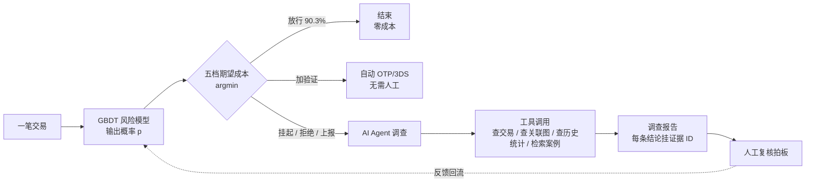
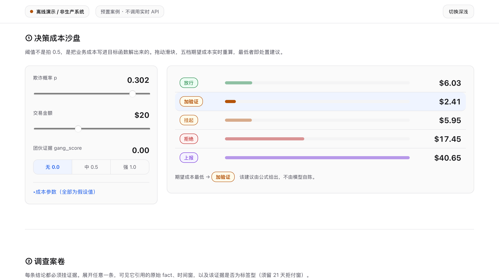
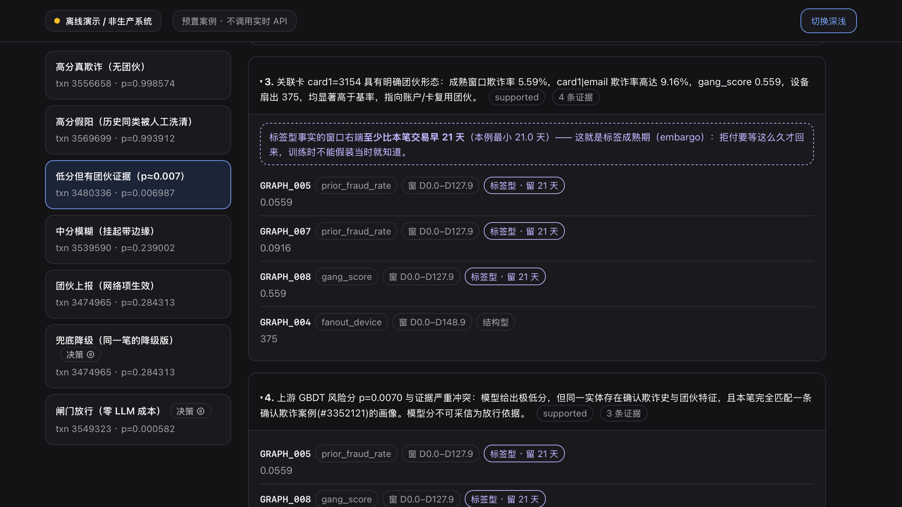
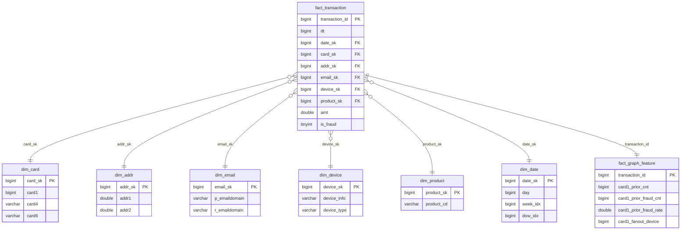

# AI Fraud Investigation Copilot

**一套交易反欺诈决策系统**：机器学习模型给出风险概率 → 成本公式解出该做什么 → AI Agent 为可疑交易做取证并写调查报告 → 人工复核拍板。

基于 Kaggle **IEEE-CIS Fraud Detection**（Vesta 真实电商交易，59 万笔，欺诈率 3.5%）。单人项目 · 2026。

> **这是一个离线决策系统**，不是线上服务：未上线、无实时链路、无压测与灰度。
> 仓库里**每一个数值结论都由本仓库脚本产出**并可复算（见[「数字为什么可信」](#数字为什么可信)）。

**先看东西**：[离线演示页](#离线演示零依赖双击即开)（双击即开、不联网、不花钱）· [关键结果](#关键结果) · [仓库导航](#仓库导航)

---

## 目录

- [这个问题难在哪](#这个问题难在哪)
- [系统怎么工作](#系统怎么工作)
- [离线演示](#离线演示零依赖双击即开)
- [四层架构](#四层架构)
- [十个硬点](#十个硬点本项目的设计约束)
- [关键结果](#关键结果)
- [同一套特征的两种实现（pandas / SQL）](#同一套特征的两种实现pandas--sqlduckdb)
- [数字为什么可信](#数字为什么可信)
- [仓库导航](#仓库导航) · [快速开始](#快速开始) · [已知局限](#已知局限)

---

## 这个问题难在哪

反欺诈不是普通的二分类。它有三个特性，每一个都会让「照着教科书做」的模型在真实场景里失效。

### ① 极端不平衡：欺诈只占 3.5%

一个永远预测「不是欺诈」的模型，准确率就有 96.5%。所以**准确率（accuracy）在这里毫无意义**，
本项目全程用 **PR-AUC**（精确率-召回率曲线下面积）作主指标——它只看正类（欺诈）被排得多靠前，
不会被 96.5% 的负类稀释。

> 常见的错误处理是「重采样」或「给正类加权」，让训练集看起来平衡。
> 本项目**做了反例消融**：这么做 recall 没升，但把概率彻底毁了（校准误差 ECE 从 0.008 涨到 0.09，11 倍）。
> 后果见下一条。

### ② 成本不对称：拦错和放过，代价完全不同

- **放过一笔欺诈**：损失 = 这笔交易金额（可能 $10，也可能 $5,000）
- **拦错一个好客户**：损失 = 一个固定值（客诉、流失、人工成本），本项目取 $25

代价不对称意味着**判定阈值不该是 0.5**。它应该由成本最小化解出来：

```
本项目解出 t* = 0.078（而非 0.5）
→ 有效拦截率 recall 从 0.338 提到 0.623，总成本降 26%
```

而要解出这个阈值，模型输出的必须是**真概率**——0.7 得真的意味着「这类交易七成是欺诈」。
这就是为什么第 ① 条里「毁掉校准」是严重问题：**概率不准，成本公式算出来的阈值就是错的。**

### ③ 标签延迟：你今天不知道今天的答案

一笔交易是不是欺诈，往往要等**用户发起拒付（chargeback）**才知道，而拒付可能在几周后才到。

这带来一个隐蔽的陷阱：如果你用「这张卡历史上的欺诈率」当特征，而计算时用上了**当时还没回来的标签**，
线下指标会非常好看，上线立刻崩——因为线上那一刻，你根本拿不到那些标签。

本项目对此的处理是**两层时间纪律**（贯穿特征、规则库、案例库、Agent 取证）：

| 事实类型 | 例子 | 约束 |
|---|---|---|
| **结构型** | 这张卡关联过几台设备（fan-out） | 只能用交易时刻 `t` **之前**发生的事 |
| **标签型** | 这张卡历史欺诈率 | 还要再退 **21 天**（标签成熟期 / embargo） |

> 代价是诚实的：加上 21 天 embargo 后，PR-AUC 从 0.5645 掉到 0.5323。
> 这个下降**不是模型变差了**，是把之前偷看未来的部分还了回去。
> 本项目进一步把这个 gap 拆开：**数据量损失 ≈ 0，新鲜度损失 −0.037** —— 掉的几乎全是「拿不到最新标签」的真实代价。

---

## 系统怎么工作



### 三个角色，分工写死

| 角色 | 负责 | 不负责 |
|---|---|---|
| **GBDT 模型** | 输出风险概率 `p` | 不决定动作 |
| **成本公式** | 由 `p` + 金额 + 团伙分解出最优动作 | 不解释理由 |
| **AI Agent** | 取证、核实、写出可溯源的调查报告 | **不决定处置** |
| **人** | 最终拍板 | — |

> **为什么 Agent 不决定处置？** 这是本项目实测后改的设计。
> 让 Agent 自己给处置建议时，它和成本最优档的一致率只有 51–66%；
> 但它的**证据发现**准确率高得多（证据层 89% vs 决策层 57%，净差 +21pp）。
> 结论：**取证归 Agent，算术归公式。**

### 五档动作与它们的期望成本

设 `p` = 欺诈概率、`a` = 交易金额、`c_FP` = 误拦一个好客户的成本：

| 动作 | 期望成本 | 含义 |
|---|---|---|
| **放行** approve | `p · a` | 是欺诈就赔整笔 |
| **加验证** step-up | `c_friction + p(1−r_block)·a + (1−p)·r_abandon·margin·a` | 发个短信验证码；挡不住的仍赔，好客户可能因麻烦放弃 |
| **挂起** hold | `c_review + p·m_h·a + (1−p)·f_h·c_FP` | 转人工复核，占用复核员容量 |
| **拒绝** decline | `(1−p) · c_FP` | 直接拒；**注意它不含金额项**——拒绝一笔 $10,000 和 $1 同价 |
| **上报** escalate | `c_report + … − p·gang·k_future·A_med` | 冻结整个实体；最后一项是**拦下该实体未来批量欺诈**的收益 |

**最优动作 = 五者取最小（argmin）**。这就是演示页沙盘在做的事。

> 一个非直觉的推论：`E_decline = (1−p)·c_FP` 在 `p→1` 时趋于 0——
> **确定是欺诈时，拒绝是免费的**（没有误伤）。所以「金额小就一定被放过」是错的，
> 高分段总会被拒绝卡住。真正的盲区只在「**低分 + 微额**」的合流处。

---

## 离线演示（零依赖，双击即开）

```bash
open reports/demo/index.html      # 或直接双击该文件
```

单个 HTML 文件，**不联网、不调用任何 API、不产生任何费用**，内嵌 7 笔预置案例的完整证据链。

### ① 决策成本沙盘 —— 阈值不是拍 0.5，是解出来的



拖动「欺诈概率」与「交易金额」两个滑块，**五档动作的期望成本实时重算，最低者即处置建议**。

图示工作点（p=0.30 / $20）最优动作是**加验证**（$2.41），而不是挂起（$5.95）——
因为这笔金额太小，**掏 $5 让人复核在经济上不划算**，直接放行又要吃 0.30 的欺诈概率。
成本参数全部标注为 `[假设]`（本数据集没有它们的真值）并可现场调整，看结论稳不稳。


<details>
<summary><b>把金额往上拖，最优动作会两次翻转 —— 展开看临界点怎么来的</b></summary>

页面默认 p=0.302 时：**$73.88 → 挂起**、**$400.71 → 拒绝**。

临界点随 p 变化，有闭式解：

```
a* = c_friction / [p·r_block − (1−p)·r_abandon·margin_rate]
```

同一条曲线在**下方**还有第三个临界点（p=0.302 时约 $2.4）——低于它，连 $0.50 的验证摩擦都不划算，最优动作退回放行。

**这暴露了逐笔口径的一个盲区，位置很具体：低分 + 微额的合流处。**
能接住它的是**跨笔的 velocity 规则**（同一实体短窗内笔数），本项目已论证、未实现。

**诚实边界**：EDA 里那个「<$1 试卡欺诈簇」是**训练窗**现象；
**测试窗 <$1 共 109 笔、欺诈 0 笔**，该段占测试窗 0.17%。
所以这是**成本几何上可证、但在本项目测试窗未造成实际损失**的角落。

</details>

### ② 调查案卷 —— 每条结论都必须挂证据，且证据带时间边界



展开任意一条结论，可见它引用的**原始事实 ID、取值、时间窗、以及该事实是结构型还是标签型**。
这是为了让报告可以被**逐条对账**：任何一个数字都能回到它的来源，编造会当场露馅。

<details>
<summary><b>图中这笔的看点：Agent 的证据发现是对的，算术不是</b></summary>

GBDT 只给了 **p=0.007**（几乎判定为正常）。Agent 独立核出：该卡扇出 375 台设备、成熟窗欺诈率 5.59%，
于是写下「模型分与证据严重冲突」并建议**上报**。

**但成本明细显示公式仍判放行**——网络项在这个分数上只值约 $1.5，翻不了档。

这正是本项目把处置权交回公式的现场证据：**它的证据发现是对的，算术不是。**

</details>

页面另含 **闸门漏斗**（**90.3%** 的交易根本不进 Agent，因此不花 LLM 的钱）
与 **兜底开关**（模拟 LLM 不可用 → 降级报告仍通过同一套校验器、服务返回 200 而非 5xx）。

---

## 四层架构

### 1. ML 核心（CPU 即可）

LightGBM 风险评分 + 特征工程。**按时间切分**训练/测试（不是随机切分），加 21 天 embargo。

关键取舍：
- **主指标用 PR-AUC 不用 ROC-AUC** —— 极端不平衡下 ROC 会被大量易分负样本抬高。
  本项目的漂移监控实测印证了这点：同一段时间 ROC 稳如泰山（0.881~0.918、零告警），**PR-AUC 却波动 ~0.09**。
- **不做后验概率校准** —— 这是测出来的结论，不是省事。
  LightGBM 用 logloss 训练本身就在优化概率质量；实测决策区间（top 2%）的校准偏差只有 **0.002**，
  而套上 Platt / Isotonic 反而恶化到 **0.067**。加跑 14/28/42 天近窗排除了「样本量太小」这个混淆。

### 2. 图特征（不是 GNN）

把交易连成图：同一张卡关联了多少设备 / 多少地址 / 多少邮箱（**fan-out**），
以及这些组合键的历史欺诈率（**prior_fraud_rate**）。这是「团伙共享稀有实体」的信号。

**两层时间纪律在这里第一次落地**：结构型（fan-out / 计数）只用 `t` 之前的边；标签型（历史欺诈率）邻居标签留满 21 天。

> **为什么没上 GNN？** 不是嫌麻烦，是有量化依据。
> 纯表 vs 表+图的干净对照：PR-AUC **+0.039**（且把 embargo 拉到 60 天仍有 +0.023，说明不是泄漏）。
> 但**分组消融**显示：这 +0.039 里 **~100% 来自实体标签历史**，度 / fan-out 等纯结构特征贡献 ≈ 0（−0.0008）——
> **它们已经被数据集里的匿名计数特征 C/V 吸收了**。而 GNN 要挖的正是这部分结构信号。
> 于是 GNN 对照臂**放弃且未跑**，不作任何数字声称。

### 3. Agent 层（调 LLM API）

只对**闸门放行之外**的交易触发。四个工具：查交易字段 / 查关联实体图 / 查历史统计 / 检索相似历史案例。
产出结构化调查报告：每条结论必须挂 `evidence_ids`，引用不存在的 ID 会被校验器拦下。

**这一层的重点不是「我做了个 Agent」，是「我给它做了 eval」**（见下一节第 7 条）。

### 4. 工程层

FastAPI（打分端点 + 调查端点）、Docker、ML/Agent eval、token 成本监控、**兜底降级**、漂移监控。

---

## 十个硬点（本项目的设计约束）

这十条是项目围绕展开的核心问题。每一条都有可复算的证据，也都写明了失效边界。

| # | 问题 | 本项目怎么做的 | 结果 |
|---|---|---|---|
| 1 | **代价敏感阈值** | 把 FP/FN 成本写进目标函数解 argmin，而非拍 0.5 | t*=0.078；recall 0.338→0.623，成本 −26% |
| 2 | **时间切分防泄漏** | 按时间切分 + 21 天 embargo；两层时间纪律 | 乐观 gap PR-AUC −0.032，并拆出「新鲜度 vs 数据量」 |
| 3 | **概率校准** | 在**决策区间**验证而非全局；测完决定不套 | raw gap 0.002 已较准，套后恶化到 0.067 → **不套** |
| 4 | **不平衡的正确处理** | 反例消融：重采样 / 加权到底有没有用 | recall 不升，ECE 0.008→0.09（11×）→ **别动先验** |
| 5 | **选择性偏差** | 放行的欺诈看不到 → 标签有偏。做成可演示实验 | naive 自训练 ROC 0.872→0.848；2% 随机抽检**救回 +0.018** |
| 6 | **GBDT vs GNN 的取舍** | 干净对照 + 泄漏审计 + 分组消融 | +0.039（60 天 embargo 仍 +0.023）；增益 ~100% 来自标签历史 |
| 7 | **Agent 的 eval** | 能硬则硬：可机械判定的全部机械判定 | 编造数字 **0**（2,672 个数字全量对账）、引用完整 92.4%、泄漏审计 100% |
| 8 | **Agent 的成本** | 用 GBDT 当便宜闸门挡在贵 LLM 前 | **90.3% 交易不进 Agent**；每单 $0.113、平均 5.5 次工具调用 |
| 9 | **兜底降级** | LLM 不可用时照常出分 + 规则模板报告 | **真触发过**；降级报告过同一套校验器，服务返 200 |
| 10 | **人在环 + 漂移监控** | 复核结果回流；分窗监控 + 触发器 | 诚实结论：ROC 半年稳、**0 次告警**；PR 更敏感 |

<details>
<summary><b>第 7 条值得展开：LLM-as-judge 试过了，然后作废</b></summary>

Agent eval 的「软层」通常用另一个 LLM 当裁判（LLM-as-judge）打分。本项目做了，然后**判定它不可用并停报**：

1. **参照方与被评方同源**：裁判是 LLM，而判定标准与示例又出自同一参照方 → 分歧下降是构造保证的，不是质量提升。
2. **判别力测不出**：三个实验臂在少数类上的实际命中（2/3、1/3、0/3）**全部落在「按自身标记率瞎猜」的期望内**（1.18 / 1.02 / 0.46）。
   根因不是一致率不够高，是**少数类只有 3 条**——样本量不足的地方，一致率再高也只是在重复已知。

**要验证一个裁判，需要一个非 LLM 的参照，而我没有。** 所以这一层的数字全部作废、不对外报。

保留下来的是**硬层**：能被代码机械判定的部分（数字能否在证据池里对上、引用的 ID 是否存在、时间窗是否越界）。
这些不依赖任何裁判。

</details>

---

## 关键结果

> **只记 delta，不记绝对值。** 绝对值不说明问题，改善才说明问题。
>
> ⚠️ **版本基线**：下表所有 Agent 侧指标取自 **v3 证据池**（运行 r1 / r3 / r4）。
> 其后有一次基础设施轮 **v4-citable-context**（缺席事实与成本假设进入证据池并可被引用），
> **证据池已变，v4 之后的运行不可与本表直接比较**——跨版本比较必须重取基线。

### ML 侧

| 指标 | 数值 |
|------|------|
| 代价敏感阈值 t*=0.078（c_FP=$25）：有效拦截率 | recall **0.338→0.623**，总成本省 **26%** |
| 时间切分乐观 gap（+21 天 embargo） | PR-AUC 0.5645→0.5323（**Δ−0.032**）· ROC 0.914→0.903 |
| ↳ gap 归因（等量旧窗对照） | 数据量 ≈0（+0.005）· **新鲜度 −0.037** |
| 概率校准（决策区间验证） | raw top2% gap **0.002**；后验校准反伤尾（→0.067，42 天仍 0.056）→ **不套** |
| 不平衡反例消融 | recall 不升、ECE **0.008→0.09**（11×）、决策区间预测 0.70→0.93 虚高 |
| 选择性偏差演示 | naive 衰减 ROC 0.872→0.848（−0.024）→ 2% 抽检**救回 +0.018** |
| 概念漂移（冻结模型 6 个月滚动窗） | ROC 0.881~0.918、**0 次触发**；**PR-AUC 波动 ~0.09 更敏感** |
| 图特征增益（纯表→表+图） | PR-AUC **0.5645→0.6032（+0.039）**，60 天 embargo 仍 +0.023 |
| ↳ 增益来自哪（分组消融） | **~100% 来自实体标签历史**；结构特征 ≈0 → GNN 对照臂据此放弃 |
| 容量工作点 top1%（无 embargo） | precision 89.7% / recall 26.2% |
| （参考）baseline（无 embargo） | ROC-AUC 0.9138 / PR-AUC 0.5645 |

### Agent 侧

| 指标 | 数值 |
|------|------|
| eval 硬层：结构合规 / 编造数字 / 引用完整 / 泄漏审计 | 99% / **0**（2,672 个数字全量对账）/ **92.4%** / 100% |
| 闸门效果 | **90.3%** 交易不进 Agent；每单 **$0.113**、平均 **5.5** 次工具调用 |
| 处置一致性（vs 成本最优档，100 笔） | **51–66%**（432 组参数网格）——**单点不可报**，100 笔里 40 笔的应然档随参数改档 |
| 成本口径（HT 加权，每万笔） | 生产拓扑 **$22,914** < 全放行 $28,417；纯公式 argmin $13,811 |
| **证据层 vs 决策层**（已做多数类基线校正） | 证据层 89%（基线 57%，**+32pp**）vs 决策层 57%（基线 45%，**+11pp**）→ **净差 +21pp** |
| 独立性 / 抗谄媚（喂分翻转实验） | 分数拉高 **150×**，证据层翻转 **0/15**；冲突检出剂量梯度 0%→27%→47%→100% |
| eval 驱动的迭代（预注册一次性修订） | **干净的零**：偏宽分歧率 28%→27%（CI 跨 0）→ 处置权交回闭式解 |
| LLM-as-judge 软层 | **已作废、不报数**（见上文第 7 条展开） |

### 两个值得单独看的结果

<details>
<summary><b>⚡ 同一个特征，两个相反的答案</b></summary>

`fan-out`（一张卡关联多少台设备）：

- 对「**这一笔**是否欺诈」的增量 ≈ **0**（−0.0008，已被匿名 C/V 特征吸收）
- 对「**该实体未来 30 天**是否再作案」有 **1.72–2.64×** 的 lift

**同一个特征，两个相反的结论。** 差别不在特征，在**问题**。
所以「这个特征有没有用」这个问题本身是不完整的——必须先问「对哪个目标」。

这也是为什么它在风险评分里被丢弃，却在**上报档的网络项**里被保留。

</details>

<details>
<summary><b>网络项的效度验证：唯一一个曾经没被验证的假设</b></summary>

上报档的期望成本里有一项 `− p·gang·k_future·A_med`，代表「冻结这个实体能拦下的未来批量欺诈」。
这是整个四档框架里**唯一一个凭直觉写下、没有验证过**的假设。

补验方式：高 `gang_score` 实体在**后续 30 天**的欺诈率，是否真的显著更高。

- lift **4.6–5.0×**，在两个**不重叠**的时间窗上独立复制（t0=146 → 4.95×、t0=115 → 4.56×）
- **关键在于对照怎么选**：必须在「**同样有欺诈史**」的实体内部比较，否则测的只是「有欺诈史 vs 没欺诈史」，是同义反复
- 留一实体后仍 4.66×（不靠某个巨型实体撑着）
- 拆解：密度贡献 3.60–5.53× / **fan-out 贡献 1.72–2.64×**

**结论：方向已验证、量级未标定。** 所以记账时保守处理（上报的未来收益按零记、成本照记）。

</details>

---

## 同一套特征的两种实现（pandas / SQL·DuckDB）

特征流水线原本是纯 pandas。把**同一套特征**用 DuckDB + 小星型模型重写一遍，是为了验证一件事：

> **本项目的两层时间纪律，能不能无损地表达成 SQL 的两种窗口帧？**
> 如果能，这条纪律就不依赖某个特定实现。

**结论：能。** 结构型 = `ROWS`（位置语义），标签型 = `RANGE` + embargo 偏移（取值语义）。

**范围声明**：不新增任何特征、不做查询优化、不碰 ML 侧。
**唯一成功判据**：与 pandas 产出**逐列对账**——15 个特征列全部逐行一致（浮点 rtol=1e-9）。
详见 [`reports/sql_vs_pandas_reconciliation.md`](reports/sql_vs_pandas_reconciliation.md)。

### 这次重写里唯一需要动脑的两处

**1. `ROWS` 与 `RANGE` 必须分开用——它正好就是两层防泄漏**

| | 语义 | 窗口帧 |
|---|---|---|
| 结构型（`prior_cnt` / fan-out） | 只问「在不在本行之前」 | `ROWS BETWEEN UNBOUNDED PRECEDING AND 1 PRECEDING` |
| 标签型（`prior_fraud_cnt`） | 还要问「标签熟没熟」 | `RANGE BETWEEN UNBOUNDED PRECEDING AND 1814400 PRECEDING` |

`ROWS` 数的是**行的位置**，`RANGE` 比的是**值的大小**（这里是时间戳）。用错帧型，泄漏就从窗口定义漏回来。

**负对照证明这不是风格问题**：把 `prior_cnt` 故意改成 RANGE 帧后，
pandas vs ROWS 版不一致 **0** 行、vs RANGE 版不一致 **166** 行。

> 一个通不过负对照的对账，通过了也说明不了什么。

**2. NULL 键必须各自成组**

pandas 侧让缺失值各自独立成组，而 SQL 的 `PARTITION BY` 默认把 NULL 视作相等、会把它们塌成一个巨型组。
用 `COALESCE(key, '\x00NA#' || transaction_id)` 复刻。

<details>
<summary><b>小星型模型（8 张表）</b></summary>



| 表 | 行数 | 说明 |
|---|---|---|
| `fact_transaction` | 590,540 | 事实表，粒度 = 一笔交易 |
| `fact_graph_feature` | 590,540 | 特征事实表，15 列图特征 |
| `dim_card` | 14,318 | card1/card4/card6 |
| `dim_device` | 1,943 | DeviceInfo/DeviceType |
| `dim_email` | 743 | 收/发件邮箱域 |
| `dim_addr` | 438 | addr1/addr2 |
| `dim_date` | 183 | 相对天（`TransactionDT` 非日历时间） |
| `dim_product` | 5 | ProductCD |

建表 DDL：[`src/features/sql/01_star_schema.sql`](src/features/sql/01_star_schema.sql)　
特征 SQL：[`src/features/sql/02_graph_features.sql`](src/features/sql/02_graph_features.sql)　
构建 + 对账：`python -m src.features.build_duckdb`

</details>

---

## 数字为什么可信

仓库里每个数值结论都由脚本产出，并由三重机制保证可复算：

| 机制 | 做什么 | 怎么跑 |
|---|---|---|
| **单元测试** | 71 个，覆盖成本公式、两层防泄漏、Agent 契约、演示产物 | `python -m unittest discover -s tests -t .` |
| **报告哈希清单** | 48 份报告登记机器区哈希 + 可复制运行的生成命令 | `python -m src.eval.report_manifest` |
| **重跑对拍** | 确定性档**真重跑**，断言逐字节相同（当前 20 份） | `python -m src.eval.report_manifest --verify-rerun` |

配套还有两条：

- **`reports/` 只能由代码写。** 报告里划出显式的机器区 / 人写区（`<!-- HUMAN:BEGIN -->`），
  机器区每次重新生成都重写、手工编辑会被哈希检查拦下；**人写区的每个数字必须能在同一文件的机器区找到**。
- **出处是指针，不是搜索。** `MODEL_CARD.md` 里每个 `[实测]` 数字都标注了来源文件，并有反向核验脚本。
  原因是本项目栽过四次「同值不同义」——两个不相干的量恰好数值相同，按值搜索一定会串。

> **判断可以讨论，数字可以复算。**

---

## 仓库导航

| 想看什么 | 去哪 |
|---|---|
| **完整口径、假设、已知局限** | [`MODEL_CARD.md`](./MODEL_CARD.md) —— 模型卡 / 验证报告 |
| **测过之后决定不用的 15 件事** | [`MODEL_CARD.md`](./MODEL_CARD.md) §12.5 |
| **Agent 层的设计** | [`AGENT_DESIGN.md`](./AGENT_DESIGN.md) |
| **40 份原始分析报告** | [`reports/`](./reports/) |
| 特征工程（表 + 图） | [`src/features/`](./src/features/) |
| 模型、校准、阈值、消融 | [`src/model/`](./src/model/) |
| Agent 工具 / RAG / 报告 schema / 管道 | [`src/agent/`](./src/agent/) |
| ML eval + Agent eval + 偏差与漂移演示 | [`src/eval/`](./src/eval/) |
| FastAPI 服务 + 演示页构建 | [`src/serving/`](./src/serving/) |
| 单元测试 | [`tests/`](./tests/) |

---

## 快速开始

```bash
python3 -m venv .venv
source .venv/bin/activate
pip install -r requirements.txt

# 只想看演示（不需要数据、不需要跑任何东西）
open reports/demo/index.html

# 跑测试
python -m unittest discover -s tests -t .

# 要复现 ML 结果，先取数据（需 Kaggle 账号并同意比赛条款）
kaggle competitions download -c ieee-fraud-detection
python -m src.features.load_data
python -m src.model.train_baseline
```

> Mac 上装 LightGBM 可能需要先 `brew install libomp`。

---

## 已知局限

诚实排在前面。完整清单见 [`MODEL_CARD.md`](./MODEL_CARD.md) §8。

1. **不是线上系统**：未上线、无实时链路、无压测与灰度。所有结论都是离线的。
2. **成本参数全是假设值**：`c_FP=$25`、`c_review=$5` 等在本数据集里没有真值。
   所有依赖它们的结论**一律报区间、不报点值**，并附参数敏感性扫描。
3. **选择性偏差无法完全消除**：只有被拦下复核的样本才拿得到标签。
   本项目把它做成了可演示实验并给出缓解方案（随机放行抽检），但这是结构性问题。
4. **velocity 规则家族未实现**：能接住「低分 + 微额」盲区的跨笔规则，已论证、未开工。
5. **LLM-as-judge 层作废**：判别力测不出，原因见上文。
6. **Agent 侧样本量有限**：eval 集 100–200 笔量级，多处结论的置信区间偏宽，已在各处注明。

---

## 工具说明

设计取舍与全部技术判定由本人决定，工程实现以 Claude Code 结对完成。

仓库内**每一个数值结论都由本仓库脚本产出**，并由上文[三重机制](#数字为什么可信)保证可复算。
