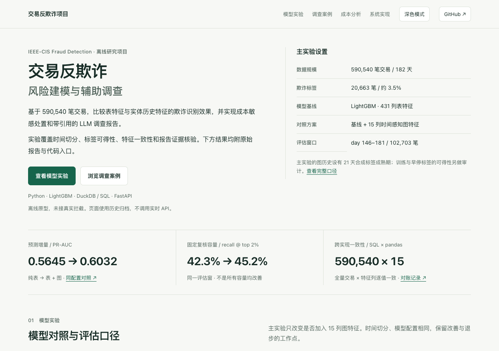

# AI Fraud Investigation Copilot
### 时间感知风险建模 · 成本敏感决策 · 可追溯的 LLM 调查

基于 590,540 笔 IEEE-CIS 交易，比较表特征与实体历史特征的欺诈识别效果，并实现成本敏感处置和带引用的 LLM 调查报告。实验覆盖时间切分、标签可得性、特征一致性与报告证据核验。

**[打开交互网站 ↗](https://1257599842-cell.github.io/AI-Agent-Fraud-Detection/)** · [结果与证据导航](docs/EVIDENCE.md) · [复现指南](docs/REPRODUCE.md) · [模型卡](MODEL_CARD.md)

> 离线研究原型，使用公开数据。网页内置历史案例，零凭证、零实时 LLM 调用即可体验；不声称已上线或产生真实业务收益。

## 主要结果

| 问题 | 实测结果 | 直接证据 |
|---|---|---|
| 实体关联历史有没有预测增量？ | 同切分、同配置，PR-AUC **0.5645 → 0.6032**；recall @ top 2% **42.3% → 45.2%** | [纯表 vs 表 + 图](reports/graph_vs_tabular.md) |
| 实验与服务的特征口径是否一致？ | SQL / pandas **590,540 笔 × 15 列**全量一致；独立在线回放 **3,000 笔 × 27 列**一致 | [全量对账](reports/sql_vs_pandas_reconciliation.md) · [回放与负对照](reports/online_replay.md) |
| 调查报告的数字能否追溯？ | r1 对 **2,672 个数字**做机械对账；565 条数值结论中 **522 条引用充分、43 条引用不完整**，未发现事实池外数字 | [两级数字对账](reports/agent_grounding.md) |

主实验中，图历史采用 21 天合成标签成熟期，训练和早停标签没有统一施加该隔离；更严格的[标签可得性审计](reports/label_availability_audit.md)另行报告。增益不适用于所有容量：top 0.5% recall 为 14.2% → 13.9%。数字能匹配事实池不等于语义正确，更不等于“零幻觉”。

## 系统分工

~~~mermaid
flowchart LR
    A["原始交易字段"] --> B["历史特征 + LightGBM"]
    B --> C["四动作成本公式"]
    C --> D["处置建议 / 调查闸门"]

    E["既有交易 ID + 离线证据库"] --> F["LLM 工具取证"]
    F --> G["事实账本 / 引用与时间检查"]
    G --> H["报告或模板降级"]
~~~

**模型预测，公式决策，LLM 组织与解释证据。** 两条线是当前的两个入口，不是已经打通的任意新交易实时流水线。报告建议不能覆盖公式动作。

- **评分层**：431 列表特征 + 15 列时间感知图特征，LightGBM 按时间窗训练。图特征是实体历史计数、成熟欺诈率与 fan-out，未使用 GNN。
- **决策层**：比较放行、挂起、拒绝、上报四种动作的期望成本。第五动作 step-up 仅离线分析，未接通 OTP/3DS。
- **调查层**：四类工具、规则与结构化案例检索、事实账本、报告验收。当前 v5 最多允许 8 次工具请求尝试；违规草稿隔离并模板降级。

技术栈：**Python · LightGBM · pandas · DuckDB / SQL · FastAPI · Docker**。检索采用结构化匹配排序，不是 embedding 向量检索。

## 方法与设计

### 1. 图特征增量与时间边界

主对照只增减图特征，再用[消融](reports/graph_feature_ablation.md)区分标签历史与裸连接数量；用[延迟实验](reports/graph_vs_tabular_e60.md)、[标签可得性审计](reports/label_availability_audit.md)检查时间假设。

跨实现对账不止检查“跑出来相同”：故意把 SQL 窗函数换错，确认负对照会被检出。空值、同秒顺序和成熟截止都进入测试。

### 2. 成本敏感处置

同样的风险分，在不同金额和误拦成本下可以对应不同动作。将假设显式写进[四动作公式](src/agent/disposition.py)，再做[敏感性分析](reports/agent_disposition_sensitivity.md)与[小额边界推导](reports/small_amount_floor.md)。

网站保留 LLM 建议与公式不一致的历史案例；调查层提供解释，不获得处置覆盖权。成本参数是假设，raw score 未校准，因此沙盘用于分析权衡，不是可直接上线的最优策略。

### 3. 调查工具与报告评估

[四轮 318 份归档的只读测量](reports/agent_autonomy_surface.md)显示取证集合高度集中；770/770 次统计查询都针对本笔字段值。**多轮自主编排相对固定流程的增益尚未被证明**，归档事实集合也不是完整调用轨迹。

当前可检查的工作是：事实账本、强制引用、数字对账、时间边界、预算约束和降级。下一项需要的实验是“固定取证 + 模板 / 固定取证 + 单次 LLM / 多轮工具循环”三臂对照，而不是继续堆工具。

## 交互演示

[打开网站](https://1257599842-cell.github.io/AI-Agent-Fraud-Detection/)，可以依次体验：

1. **调查案卷**：7 份预置案例，逐条展开结论、引用事实与时间范围；可打开原始 JSON。
2. **决策沙盘**：调节风险分、金额和关联证据，观察四动作成本；可切换五动作离线扩展。
3. **模板降级**：对照同一笔交易的 LLM 报告和确定性模板，查看历史验收与费用。

网站与本地 HTML 是同一份构建产物；断网可打开，外部证据链接需要网络。案例标签 0 不代表人工洗清，选取的相似案例比例也不代表风险概率。

## 快速复核

无需数据和 API key，即可浏览网站、读取报告或检查页面构建：

~~~bash
git clone https://github.com/1257599842-cell/AI-Agent-Fraud-Detection.git
cd AI-Agent-Fraud-Detection
python3 -m src.serving.build_demo_page --check
# 直接用浏览器打开 docs/index.html
~~~

运行测试（需要 Python 环境，不需要原始交易数据或付费 LLM）：

~~~bash
python3 -m venv .venv
source .venv/bin/activate
pip install -r requirements.txt
python -m unittest discover -s tests -t .
~~~

数据、模型训练、API 启动、浏览器检查分别见[分层复现指南](docs/REPRODUCE.md)。模型和大体量数据不随仓库发布；下载 IEEE-CIS 数据须自行接受比赛条款。

## 代码与证据地图

| 入口 | 内容 |
|---|---|
| [src/features](src/features) · [SQL](src/features/sql) | 时间感知图特征、SQL 数据建模与特征实现 |
| [src/model](src/model) | 时间切分、模型对照、校准、成本、不平衡与漂移实验 |
| [src/agent](src/agent) | 成本决策、知识检索、工具后端、事实账本与输出验收 |
| [src/eval](src/eval) · [tests](tests) | 机械评估、受控干预、报告清单与回归测试 |
| [src/serving](src/serving) | FastAPI、历史特征查询、回放与离线网页构建 |
| [docs/EVIDENCE.md](docs/EVIDENCE.md) | 按问题组织的报告、实现与限制索引 |
| [EXPERIMENT_PROTOCOL.md](EXPERIMENT_PROTOCOL.md) · [MODEL_CARD.md](MODEL_CARD.md) | 当前实验口径、版本边界、完整模型卡 |

补充实验：[银行 KS 与分层表](reports/bank_metrics.md) · [WOE/IV 评分卡](reports/scorecard.md) · [校准](reports/calibration.md) · [选择性标签](reports/selective_bias.md) · [漂移监控](reports/drift_monitor.md)。

## 使用边界

- **研究边界**：没有真实拒付到达时间、真实干预结局或未使用的新最终评估时段；成本改善不是线上收益。
- **服务边界**：评分历史快照不随请求追加；调查仍针对已有交易 ID。未接案件队列、真实拦截、反馈重训与并发生产压测。
- **评估边界**：历史 LLM 归档与当前 v5 保护机制分属不同版本，未重跑付费评估；LLM-as-judge 未成为可靠的软层验收标准。

更详细的限制、修订与出处见[模型卡](MODEL_CARD.md)、[独立审查](AUDIT_REPORT.md)和[证据导航](docs/EVIDENCE.md)。历史实验与原始归档保留，不用新文案改写旧结果。

---

代码采用 [MIT License](LICENSE)；数据使用遵循 [IEEE-CIS 比赛条款](https://www.kaggle.com/competitions/ieee-fraud-detection/rules)。工程实现使用 AI 结对协助。
