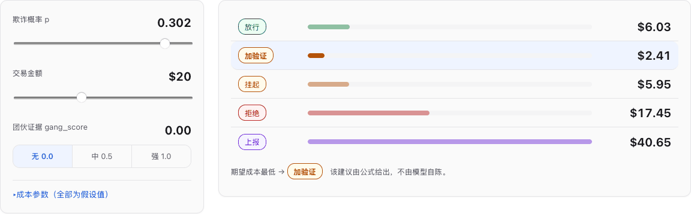
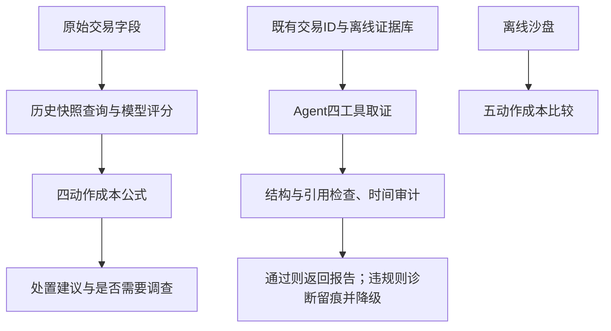

# AI Fraud Investigation Copilot

交易反欺诈离线决策系统：LightGBM 评分、成本公式给出处置建议、Agent 取证与生成报告。




[打开历史离线演示页](https://1257599842-cell.github.io/AI-Agent-Fraud-Detection/)，或本地打开 `reports/demo/index.html`。页面内置案例、四/五动作成本比较，不调用 API。网页部署内容可能早于本次本地审查修订。

当前 API 与 Agent 使用**四动作**（approve / hold / decline / escalate）；第五动作 stepup 仅用于离线分析和沙盘。没有接通 OTP/3DS、案件队列、实际拦截或反馈重训闭环。

完整口径见 [实验与实现索引](EXPERIMENT_PROTOCOL.md)、[模型卡](MODEL_CARD.md)及[独立审查报告](AUDIT_REPORT.md)。

## 系统做什么

| 环节 | 实际实现 | 输出 |
|---|---|---|
| 评分 | 431表列 + 15图列输入 LightGBM | raw 风险分 p |
| 决策 | 四动作期望成本 argmin | 确定性处置建议 |
| 取证 | 四工具 + 规则/结构化案例检索 | 报告、事实账本、校验结果 |
| 五动作扩展 | 离线成本分析与沙盘 | 加入stepup后的成本与队列敏感性 |

`/score` 收原始字段，在线计算27列历史特征；15列图特征入主模型，12列velocity只作诊断返回。fan-out仍在模型输入中。Agent给出的处置建议用于评估与叙述，不能覆盖公式决策。


```mermaid
flowchart TD
    A[原始交易字段] --> B[历史快照查询与模型评分]
    B --> C[四动作成本公式]
    C --> D[处置建议与是否需要调查]
    E[既有交易ID与离线证据库] --> F[Agent四工具取证]
    F --> G[结构与引用检查、时间审计]
    G --> H[通过则返回报告；违规则诊断留痕并降级]
    I[离线沙盘] --> J[五动作成本比较]
```

评分与调查目前是两个演示入口：任意新交易尚不能自动进入调查后端。`/score`预灌day<146历史，不追加请求；只有独立回放脚本执行“先查后写”。因此回放一致性不代表HTTP服务已实现流式状态。

## 快速开始

```bash
python3 -m venv .venv
source .venv/bin/activate
pip install -r requirements.txt
python -m unittest discover -s tests -t .
open reports/demo/index.html
```

复现模型需要自行取得 [Kaggle IEEE-CIS 数据](https://www.kaggle.com/competitions/ieee-fraud-detection)，同意比赛条款后将两张训练CSV放在 `data/`。可选CLI下载：

```bash
pip install kaggle
kaggle competitions download -c ieee-fraud-detection -p data
unzip data/ieee-fraud-detection.zip -d data
python -m src.features.load_data
python -m src.features.graph_features
python -m src.agent.disposition
python -m src.agent.knowledge
uvicorn src.serving.app:app --port 8000
```

首次构建`disposition`会训练并落盘模型/分数；有分数缓存但模型文件缺失时也会重建。模型与知识库不随仓库发布。

```bash
curl -X POST http://localhost:8000/score \
  -H 'Content-Type: application/json' \
  -d '{"transaction_dt":16000000,"fields":{"TransactionAmt":100,"ProductCD":"W","card1":1234}}'
```

金额必须提供有限非负值；其余缺失特征由模型原生处理。实时LLM调查另需安装`anthropic`并配置服务凭证；未配置时闸门仍可放行，其余走规则模板降级。

```bash
docker build -t fraud-copilot .
docker run -p 8000:8000 \
  -v "$PWD/data:/app/data:ro" \
  -v "$PWD/models:/app/models:ro" fraud-copilot
```

容器不带数据或模型，须先在本地完成上述构建。`/healthz`显示调查资源状态，评分模型在首次评分时加载。

## 主要结果及适用范围

数据为590,540笔IEEE-CIS训练交易，欺诈率3.499%，跨度182天；官方无标签test不参加线下评估。

| 实验 | 历史结果 | 边界 |
|---|---|---|
| 主实验纯表→表+图 | PR-AUC 0.5645→0.6032，ROC-AUC 0.9138→0.9306 | fit<132，val[132,146)，eval≥146；训练/早停没有21天标签隔离 |
| 图标签延迟21→60天 | PR-AUC增益+0.0387→+0.0234 | 仅改变图特征标签可见窗，不能证明完全无泄漏；该−39.6%是**联合差异**（数量/年龄/噪声/缺失率同时变），见下行 |
| 等宽滑窗拆年龄（新增） | 新鲜39天带**+0.0393** vs 陈旧39天带**+0.0148**，年龄效应**+0.0245**；且新鲜39天带≈累积到底（+0.0393 vs +0.0387，差0.0006）→ **更老的标签历史几乎冗余，约40天滚动窗即够** | 评估窗邻居数量已对齐(B/A 1.03–1.05×)但训练窗未对齐(0.62–0.75×)；B_stale不可与+0.0234相比；未做显著性检验 |
| 纯表训练窗口隔离 | PR-AUC 0.5645→0.5323 | 训练量、样本年龄、验证窗和早停共同变化 |
| 等量旧窗对照 | 砍旧−full +0.0048；砍新−砍旧 −0.0370 | 描述性差异，不能称纯数据量/纯新鲜度效应 |
| 独立纯表校准实验 | top2% gap raw 0.002，Platt 0.089，Isotonic 0.067；**gap/SE 分别 0.2 / 8.7 / 6.5** | 独立模型；Isotonic在top1%反而更好（gap/SE 3.5→2.0），不能外推所有工作点。SE 为一阶近似，非假设检验 |
| 历史成本扫描 | t*=0.078，recall 0.338→0.623，模型化成本−26.1% | 在eval真标签上扫描的事后结果，不是预选阈值独立测试收益 |
| 类别不平衡消融 | 加权/过采样未提升recall，ECE约0.008→0.09 | 当前配置的结果，不是所有重采样方法的定理 |
| 选择性标签演示 | ROC 0.8721→0.8478；随机抽检后0.8657（**补回衰减的73.4%**） | 遮蔽低分放行样本，未抽检者仍伪标0；recovery自身也掉0.0065，**缓解而未消除**偏差 |
| 漂移监控 δ 标定 | 按各指标抽样噪声标定（窗内自助B=500）：ROC δ=0.0139 → **0/6 告警**；PR δ=0.0364 → **3/6（连续2窗规则下2次）**。落差信噪比 **ROC 1.5（与零不可区分） vs PR 5.0（确定是真下滑）** | **结论不是"系统很稳"，是"原本选的监控指标看不见这次下滑，而我把它测出来了"**——"0告警"描述的是尺子不是系统。自动重训/重校准闭环仍未实现 |
| 检出率（**构造场景**） | 注入 `p'=(1−α)p+αu`（只动分数不动标签），用同一次标定的δ检：**ROC 在α=0.05新增4/6告警、注入当窗即检出；PR 新增0**（α=0.10才新增1/6且延迟4窗）。α=0对照的新增列实测为0 | **与真数据结论相反 → 「敏感的指标」≠「敏感的触发器」**（PR的δ更宽正因它更噪，且已饱和）→ 故**不选定单一触发指标，两指标并列上报**。不是"经历过真实退化"的证据；只测了无结构噪声一种形态、单种子、无显著性检验 |
| 新增标签可得性审计 | PR-AUC纯表0.5086、表+图0.5531 | 全部拟合/选择标签在day146前合成成熟；仍是回顾性评估 |

具体输出见 [主对照](reports/graph_vs_tabular.md)、[新审计](reports/label_availability_audit.md)、[校准](reports/calibration.md)、[成本扫描](reports/cost_sensitive.md)。新审计结果不替代主对照；窗口和校准流程同时变化，不能把差异归于单一因素。

图消融表明标签历史是主要增益来源，fan-out去除的差异很小。匿名C/V是否吸收了结构信号只是解释假说；没有跑GNN对照，不能声称已经证明GNN无效。

## 银行指标与评分卡对照

同一主实验缓存复算：KS **0.6780→0.7052**，PR-AUC **0.5645→0.6032**。
[KS与两臂十等分表](reports/bank_metrics.md)列出训练、验证、测试各窗；样本内与时间外之差不能单独识别漂移。
[评分卡最小对照](reports/scorecard.md)提供WOE/IV、筛选记录、PDO=20分值表及精确产物：
评分卡KS **0.4779**、PR-AUC **0.3114**，在相同预设二动作阈值下模型化损失比GBDT高 **68.9%**。
[PSI监控](reports/drift_monitor.md)已有独立早期模型滚动实验，不能与主模型混用。

## Agent评估与当前保护

| 归档评估 | 结果 |
|---|---|
| r1结构合规 | 99% |
| r1数字机械对账 | true_ungrounded 0/565；2,672个数字检查 |
| r1引用完整率 | 522/565=92.4% |
| 历史时间审计 | 100% |
| 证据层与决策层一致率 | 89%与57%；多数类基线校正后净差+21pp |
| 四档闸门与历史费用 | 90.3%不进Agent；r1平均$0.1131/单、5.5次工具调用 |

这些是特定归档和机械规则下的测量，不能证明所有报告推理正确。数字在事实池里存在，也不等于语义和归因成立。成本是当时的估算价格。参见 [Agent数字对账](reports/agent_grounding.md) 与 [证据/决策对照](reports/agent_evidence_vs_decision.md)。

历史`validate_report`只记录违规，预算只在轮次开始检查。当前`v5-validated-output`增加了逐工具执行检查（最多8次请求尝试）、违规草稿隔离与模板降级；未知工具和畸形参数也受预算约束。R1排除`null_result`以及没有正标签支持的零`gang_score`，避免把“未查到历史”当作已经取得成熟标签证据。该改动没有重跑付费LLM评估，不能沿用旧指标声称新管道效果。

LLM-as-judge曾尝试，但参照独立性与少数类样本不足使判别力无法确认，软层比率停报。抗谄媚实验的证据层翻转0/15也只是这批受控样本的结果。

## 成本框架与小额边界

四动作成本包含放行损失、人工复核、误拦损失、上报成本和假设未来收益；离线再加入stepup。所有干预成本参数均是假设，网络关联的效度不等于冻结实体的因果收益。

小额放行边界取**四种干预约束的最小值**。`p=.01,g=0`时hold约束为610.56；`p=.30,g=0`时stepup约束为2.4420。`p=1,g=0`时拒绝对任何正金额都更便宜。详见 [完整推导与数值核验](reports/small_amount_floor.md)。

velocity的12条规则通过训练窗准入，但没有解决低分微额段的识别问题。固定命中率下可计算lift上界；无欺诈样本时实测lift未定义，不能外推为所有未来数据上的“不可能”。这些规则尚未并入Agent规则库或风险模型。

## 可复算性与局限

```bash
python -m unittest discover -s tests -t .
python -m src.eval.report_manifest
python -m src.eval.report_manifest --verify-rerun
python -m src.model.label_availability_audit
```

报告生成器、归档原始返回与冻结件登记于`reports/_manifest.json`。哈希检查用于发现文件变化；数字出处工具只是辅助诊断，仍需核对语义。模型和大型数据留在本地；演示页是既有样本的静态展示。

项目未上线、没有真实拒付到达时间、没有未使用的新最终时段、没有真实动作结局或收益标签，也未做并发压测与灰度。Kaggle旧提交的未知标签分母存在错误，代码现已修复但没有重新提交；排名与旧分数不作为项目亮点。

代码采用 [MIT许可](LICENSE)。数据遵循 [比赛条款](https://www.kaggle.com/competitions/ieee-fraud-detection/rules)，须自行取得。个人学习和求职资料不随仓库发布。

设计取舍与技术判定由项目负责人决定，工程实现使用AI结对协助。
