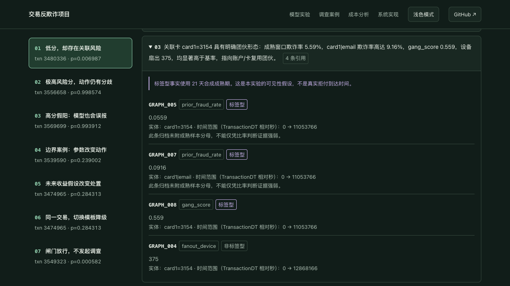

# 交易反欺诈：风险建模与辅助调查

基于 **590,540 笔 IEEE-CIS 交易**的离线研究与服务原型：用 LightGBM 和时间感知实体特征预测风险，用成本公式选择处置，用带引用的 LLM 报告辅助调查。重点验证特征增量、时间边界，以及报告是否有据可查。

[交互演示](https://1257599842-cell.github.io/AI-Agent-Fraud-Detection/) · [证据导航](docs/EVIDENCE.md) · [复现指南](docs/REPRODUCE.md) · [模型卡](MODEL_CARD.md) · [全部文档](docs/README.md)

## 主要结果

| 验证问题 | 结果 | 实验记录 |
|---|---|---|
| 实体历史能否改善预测？ | 431 列表特征 → 加入 15 列图特征，PR-AUC **0.5645 → 0.6032**；recall @ top 2% **42.3% → 45.2%** | [同配置对照](reports/graph_vs_tabular.md) |
| 不同实现的特征是否一致？ | SQL / pandas **590,540 笔 × 15 列**一致；先查后写回放 **3,000 笔 × 27 列**一致，并设置错误实现的负对照 | [SQL 对账](reports/sql_vs_pandas_reconciliation.md) · [回放](reports/online_replay.md) |
| 报告数字能否追溯到证据？ | r1 的 **2,672 个数字**经机械对账；565 条数值结论中 **522 条引用充分、43 条引用不完整** | [两级数字对账](reports/agent_grounding.md) |

主对照的图历史使用 21 天合成标签成熟期，训练和早停标签未统一隔离；[更严格的标签可得性审计](reports/label_availability_audit.md)单独报告。增益并非覆盖所有容量：top 0.5% recall 为 14.2% → 13.9%。数字可追溯不等于推理正确。

## 系统设计

~~~mermaid
flowchart LR
    A["原始交易字段"] --> B["历史特征 + LightGBM"]
    B --> C["四动作成本公式"]
    C --> D["处置建议"]

    E["既有交易 ID"] --> F["闸门 / LLM 工具取证"]
    F --> G["事实账本 + 输出验收"]
    G --> H["带引用报告 / 模板降级"]
~~~

**模型预测，公式决策，LLM 组织与解释证据。** /score 接受原始交易字段；/investigate 针对离线证据库中的既有交易 ID。两者尚未打通任意新交易的实时调查链路，LLM 建议不能覆盖公式动作。

- **特征与模型**：实体历史计数、成熟欺诈率、fan-out；按时间切分训练 LightGBM，不使用 GNN。SQL 与 pandas 独立实现，检查空值、同秒顺序和标签成熟截止。
- **成本决策**：显式比较放行、挂起、拒绝、上报的期望成本，并分析参数敏感性。第五动作 step-up 仅用于离线分析与网页沙盘。
- **调查与验收**：四类工具、结构化规则/案例检索、唯一证据 ID、引用和时间检查。当前 v5 最多 8 次工具请求尝试；已检测到的无效草稿隔离，失败时按相同结构验收模板报告。

技术栈：Python 3.13 · LightGBM · pandas · DuckDB / SQL · FastAPI · Docker。规则与案例采用结构化匹配，不依赖向量数据库。

## 从这些实现开始读

| 设计取舍 | 核心实现 | 对应验证 |
|---|---|---|
| 结构历史与标签历史采用不同时间边界 | [图特征](src/features/graph_features.py) · [SQL 窗函数](src/features/sql) | [泄漏边界测试](tests/test_leak_prevention.py) · [特征消融](reports/graph_feature_ablation.md) |
| 相同风险分，金额与成本不同可以产生不同动作 | [四动作公式](src/agent/disposition.py) | [成本模型测试](tests/test_cost_model.py) · [敏感性分析](reports/agent_disposition_sensitivity.md) |
| LLM 输出必须能追到本次调用返回的事实 | [事实账本](src/agent/tools.py) · [调查管道](src/agent/pipeline.py) | [Agent 契约测试](tests/test_agent_contracts.py) · [数字对账](reports/agent_grounding.md) |
| 服务特征不能只凭离线测试推定正确 | [历史特征查询](src/serving/feature_store.py) · [API](src/serving/app.py) | [独立回放与负对照](reports/online_replay.md) |

关于 Agent 的一个未决问题：多轮工具选择是否优于固定流程？[四轮 318 份归档的测量](reports/agent_autonomy_surface.md)显示取证集合高度集中，770/770 次统计查询均针对本笔字段值。**现有证据尚不能证明自主编排的增益**；完整调用轨迹与固定流程 / 单次 LLM / 多轮工具循环三臂对照仍需补充。

## 交互演示

[打开在线演示](https://1257599842-cell.github.io/AI-Agent-Fraud-Detection/)——不需要账号、API key 或下载数据，也不产生实时 LLM 费用。

- **7 份历史案卷**：展开结论、原始引用和时间范围，查看 LLM 建议与公式不一致的案例。
- **四 / 五动作沙盘**：改变风险分和金额，比较动作成本；五动作明确标为离线扩展。
- **降级对照**：查看同一交易的历史 LLM 报告与确定性模板。

查看页面预览

## 本地验证

仅检查网页是否由当前模板生成，只需 Python 标准库：

~~~bash
git clone https://github.com/1257599842-cell/AI-Agent-Fraud-Detection.git
cd AI-Agent-Fraud-Detection
python3 -m src.serving.build_demo_page --check
# 用浏览器打开 docs/index.html；案卷与沙盘支持离线使用
~~~

运行数据无关测试和归档完整性检查（Python 3.13）：

~~~bash
python3.13 -m venv .venv
source .venv/bin/activate
python -m pip install -r requirements.txt
python -m unittest discover -s tests -t .
python -m src.eval.report_manifest
~~~

核心依赖及其传递依赖固定版本；Notebook 和浏览器验收依赖单独安装。测试不需要原始交易数据或付费 LLM。模型重建、API 启动、依赖维护与平台要求见[复现指南](docs/REPRODUCE.md)。

## 适用范围与已知限制

- **离线研究，不是已上线系统**：使用公开匿名数据，没有真实拒付到达时间、真实干预结局或新的未使用最终评估时段。成本参数是假设，raw score 未校准，不能把沙盘结果当作线上收益。
- **服务是原型**：评分使用固定历史快照，不随请求追加；尚未接案件队列、实际拦截、反馈重训或并发生产压测。
- **评估有版本边界**：历史 LLM 归档与当前 v5 保护机制分属不同版本，未重跑付费评估；机械验收不能替代语义判断，LLM-as-judge 尚无可靠独立参照。

详细口径见[实验协议](EXPERIMENT_PROTOCOL.md)与[模型卡](MODEL_CARD.md)。设计历史、审查记录和报告索引统一收在[文档目录](docs/README.md)；原始实验与归档保持原文。

---

代码采用 [MIT License](LICENSE)；原始数据与模型不随仓库发布，数据使用遵循 [IEEE-CIS 比赛条款](https://www.kaggle.com/competitions/ieee-fraud-detection/rules)。工程实现使用 AI 结对协助。
