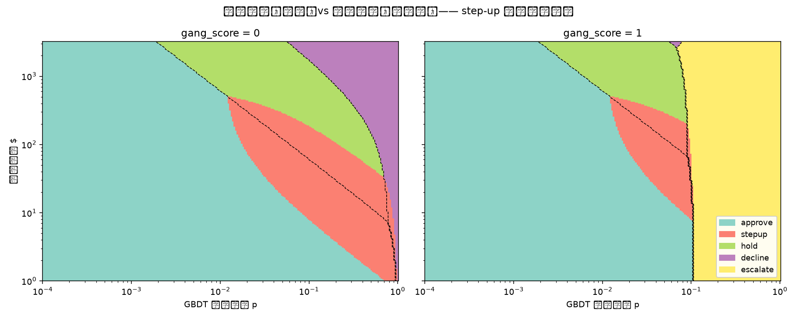

# step-up 第五档（Q1）

真实风控系统里最常用的动作是 step-up（加验证 / OTP / 3DS），而本框架此前只有四档。
缺了它，「可疑但不确定」只能被推向更重的动作——**这正是「项目是否太 toy」的正解**。

## 期望成本

```
E_stepup = c_friction + p·(1−r_block)·amount + (1−p)·r_abandon·margin_loss
```
其中 `margin_loss = margin_rate × amount`（毛利随金额走比固定值合理）。

### ⚠️ 四个参数全部 `[假设]`，无结局数据可估

IEEE-CIS **没有**「加验证后是否通过 / 是否放弃」的记录 → 与 `c_review` 同一条纪律：
**一律标 [假设] 并做敏感性扫描，不得当实测报。**

| 参数 | 基准值 `[假设]` | 扫描范围 | 含义 |
|---|---|---|---|
| `c_friction` | $0.50 | [0.1, 0.5, 2.0] | 每次加验证的摩擦成本 |
| `r_block` | 0.7 | [0.5, 0.7, 0.9] | 加验证挡住欺诈的比例 |
| `r_abandon` | 0.05 | [0.02, 0.05, 0.15] | 好客户因摩擦放弃的比例 |
| `margin_rate` | 0.15 | [0.05, 0.15, 0.3] | 毛利率（放弃一笔的损失） |

## 预注册预测（跑前写死）

> **step-up 将吃掉 hold 与 decline 之间的中间大片区域。**
> 它比 hold 便宜（不占人力）、比 decline 温和（不直接误伤）。

## 结果：test 窗 102,703 笔的档位分布

| 动作 | 四档 | 五档 | 变化 |
|---|---|---|---|
| approve | 92,735（90.29%） | 84,874（82.64%） | -7,861 |
| stepup | 0（0.00%） | 10,937（10.65%） | +10,937 |
| hold | 6,946（6.76%） | 3,916（3.81%） | -3,030 |
| decline | 315（0.31%） | 309（0.30%） | -6 |
| escalate | 2,707（2.64%） | 2,667（2.60%） | -40 |

### step-up 拿走的 10,937 笔，原本属于哪一档

| 原四档归属 | 笔数 | 占 step-up |
|---|---|---|
| approve | 7,861 | 71.9% |
| hold | 3,030 | 27.7% |
| escalate | 40 | 0.4% |
| decline | 6 | 0.1% |

### 预注册判读

❌ **预测不成立，照实报**：仅 28% 来自 hold/decline；**72% 来自 `approve`**。

### 为什么错了——机制（算得出来，不是事后找补）

我的预测隐含了一个错误的推理：「step-up 比 hold 便宜、比 decline 温和 → 它落在两者之间」。
**成本排序说的不是这个。** step-up 是**全部五档里最便宜的干预**（摩擦仅 $0.50，而 hold 要 $5、贵 10 倍），
所以它扩张的是 **`approve` 的上边界**，不是最贵两档之间的缝。

两条门槛线（同一批参数下算出）：

| 交易金额 | step-up 击败 approve 所需 p | hold 击败 approve 所需 p |
|---|---|---|
| $50 | **p > 0.025** | p > 0.122 |
| $100 | **p > 0.018** | p > 0.061 |
| $300 | **p > 0.013** | p > 0.020 |
| $1000 | **p > 0.012** | p > 0.006 |

→ 在中小额区间，step-up 的启动门槛比 hold **低一个数量级**：
它先于 hold 从 approve 那里接管，自然吃的是 approve 而不是 hold/decline 中间带。

### 但结果本身比我的预测更像真实系统

- step-up 覆盖 **10.6%** 的交易量 —— 真实支付风控里 3DS/OTP 挑战率通常也在 **5–15%** 这个量级，属**高频低摩擦**动作。
- 同时把人工复核队列从 6,946 压到 3,916（**−44%**），这正是 step-up 在真实系统里的第二个作用：**替人力挡掉一批不值得人看的单子**。

> ⚠️ 上面这条只是**量级合理性核对**，不是验证——本数据没有 step-up 的结局标签，
> 「10.65% 落在真实系统常见区间」**不能**当作参数取对了的证据。

> **我不把这写成「框架长出了真实形状」**：预测错了就是错了。
> 可以讲的是另一句——**错误的是我的直觉，代价公式给出的排序是对的**：
> 最便宜的干预本来就该从「什么都不做」的边界上接管，而不是去挤最贵两档之间的缝。

### (a) 领域断言（**由总指挥提供，标注为断言、非本数据结论**）

> 真实支付风控中，3DS / step-up 挑战**本就主要打在会放行的流量上**——它是给「本来要放过、但想再确认一下」的交易加一道门，而不是给已经决定人工复核的单子加门。

→ 若该断言成立，则**实测形状（72% 来自 approve）比预注册预测更贴近真实系统**。
⚠️ 这是**领域知识断言，不是本数据的结论**：本数据没有 step-up 结局标签，无法验证它。
**它只能用来解释结果为何合理，不能用来当作结果正确的证据。**

### (b) 可讲的工业化延伸

step-up 占比由「**摩擦有多贵**」决定——全网格 **0.0%–55.8%**，是本项目所有敏感性扫描里区间最宽的一个。

→ **真实部署要标定的第一个参数是 `r_abandon`**（也即 challenge rate 对放弃率的影响），
  因为它同时进入 step-up 的成本项、又直接决定这一档吃掉多少流量。
  标定方式是现成的：**challenge rate 的 A/B**——给一部分流量加验证、比较完成率与欺诈率。
> 这条也是本项目「参数全部标假设」这一纪律的自然出口：
> **不是永远停在假设，而是明确指出「上线后第一件要测的是哪一个」。**

## 敏感性扫描（四参数全网格）

| 参数 | 取值 | step-up 占比 | 主要来源 |
|---|---|---|---|
| `c_friction` | 0.1 | 17.1% | approve（81%） |
| `c_friction` | 0.5 ←基准 | 10.6% | approve（72%） |
| `c_friction` | 2.0 | 3.1% | hold（52%） |
| `r_block` | 0.5 | 5.7% | approve（76%） |
| `r_block` | 0.7 ←基准 | 10.6% | approve（72%） |
| `r_block` | 0.9 | 16.2% | approve（67%） |
| `r_abandon` | 0.02 | 18.3% | approve（77%） |
| `r_abandon` | 0.05 ←基准 | 10.6% | approve（72%） |
| `r_abandon` | 0.15 | 3.1% | approve（64%） |
| `margin_rate` | 0.05 | 19.6% | approve（78%） |
| `margin_rate` | 0.15 ←基准 | 10.6% | approve（72%） |
| `margin_rate` | 0.3 | 5.4% | approve（67%） |

> **扫描直接印证了上面的机制解释**：把 `c_friction` 从 $0.50 提到 **$2.00** 后，
> step-up 占比降到 3.1%，而**主要来源从 `approve`（72%）变成 `hold`（52%）**——
> 也就是**我原本预测的那个形状**。
> → 「step-up 从谁那里吃」**不是它的固有属性，而是它相对谁更便宜的函数**。
> 我的预测隐含假定了它跟 hold 一个价位；在基准参数下它便宜 10 倍，位置自然不同。


**全网格 81 组**：step-up 占比 **0.0% – 55.8%**（中位 8.1%）。
→ **占比对参数敏感，故一律报区间，不报点值**（同 §7 层1 一致率的处理）。

## ⑧ 漏斗红利：step-up 不需要 Agent 介入

step-up 是一条**自动动作**——既不烧 LLM，也不占人工复核队列。

| 口径 | 不进 Agent 的交易 | 占比 |
|---|---|---|
| 四档（仅 approve 放行） | 92,735 | 90.3% |
| 五档（approve + stepup 均自动） | 95,811 | **93.3%** |

→ **漏斗又便宜了一层**：需要 Agent 或人工的交易从 9.7% 降到 **6.7%**（10,937 笔转为自动加验证）。
> 这与 ⑧「便宜模型挡在贵 LLM 前」是同一条思路的延伸：
> **能用一条自动动作解决的，不要送进需要人或大模型的队列。**

## 分区图



色块 = 五档 argmin 分区；**黑色虚线 = 原四档边界**，直观显示 step-up 从哪里吃进来。

## 口径声明（重要）

本模块**不修改** `src/agent/disposition.py`：既有全部数字（应然档、层1/层2、
round 3/4、成本归因）都建立在**四档**口径上，改它会让历史结论失去可复现性。
**五档只并列呈现，不覆盖四档。**
